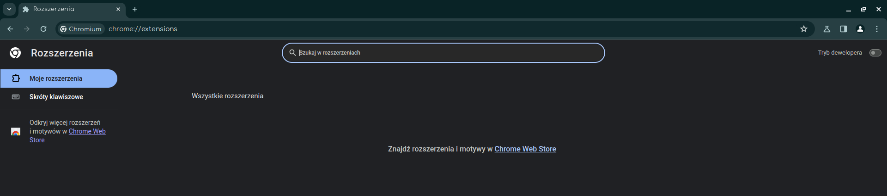

# Instalacja rozszerzenia


 **Chrome**

###### Ta sekcja dotyczy również przeglądarek opartych na silniku Chromium (np. Microsoft Edge)


### 1. Pobierz rozszerzenie z Github

Na początku musiz pobrać rozszerzenie z oficjalnej strony na Github. Jeśli masz zainstalowany program **GIT** to niezależnie od systemu operacyjnego uruchom konsolę (wiersz poleceń/terminal) i wprowadź następujące polecenie:

```bash
git clone "https://github.com/EntentaPL/Scratch-Trends.git"
```

Alternatywnie, jeśli nie posiadasz programu **GIT** , spróbuj wprowadzić takie polecenia do konsoli:

```powershell
curl -Lo trends.tar.gz "https://github.com/EntentaPL/Scratch-Trends/archive/beta.2.tar.gz"
tar -xf trends.tar.gz
```

Jeżeli jednak obawiasz się konsoli możesz pobrać rozszerzenie bezpośrednio ze strony Github. <a href="https://github.com/EntentaPL/Scratch-Trends/archive/refs/heads/beta.2.zip">Kliknij w ten link</a>, aby pobrać rozszerzenie jako plik **.zip** , a następnie korzystając z lokalnych programów (np. 7-ZIP) rozpakuj te archwium.

### 2. Zainstaluj rozszerzenie

1. Kiedy już pobrałeś rozszerzenie i posiadasz uzyskany katalog, możesz przejść do instacji rozszerznia. W tym celu otwórz stronę do zarządzania rozszerzeniami [chrome://extensions](chrome://extensions)



2. Następnie aktywuj **Tryb dewelopera** - przycisk znajduje się w prawym górnym rogu.

3. Pojawiły się trzy nowe przyciski. Kliknij ten z napisem *Załaduj rozpakowane*.

4. W menu do wyboru katalogu wybierz ten, który uzyskałeś podczas etapu pobierania.

5. Powinieneś teraz zobaczyć nowe pole z tytułem "Scratch Trends". To oznacza, że rozszerzenie zostało zainstalowane pomyślnie.

<br>


 **Firefox**

### 1. Zainstaluj rozszerzenie z addons.mozilla.org

1. W przypadku Firefoxa instalacja tego rozszerzenia jest banalnie prosta. Aby to uczynić
wejdź [udaj się na tę stronę](https://addons.mozilla.org/en-US/firefox/addon/scratch-trends/) i kliknij niebieski przycisk **dodaj do Firefox** . Zaakceptuj również
przycisk **Dodaj** w okienku, które następnie Ci wyskoczy.

2. Powinieneś teraz zobaczyć nowe pole z tytułem "Scratch Trends". To oznacza, że rozszerzenie zostało zainstalowane pomyślnie.